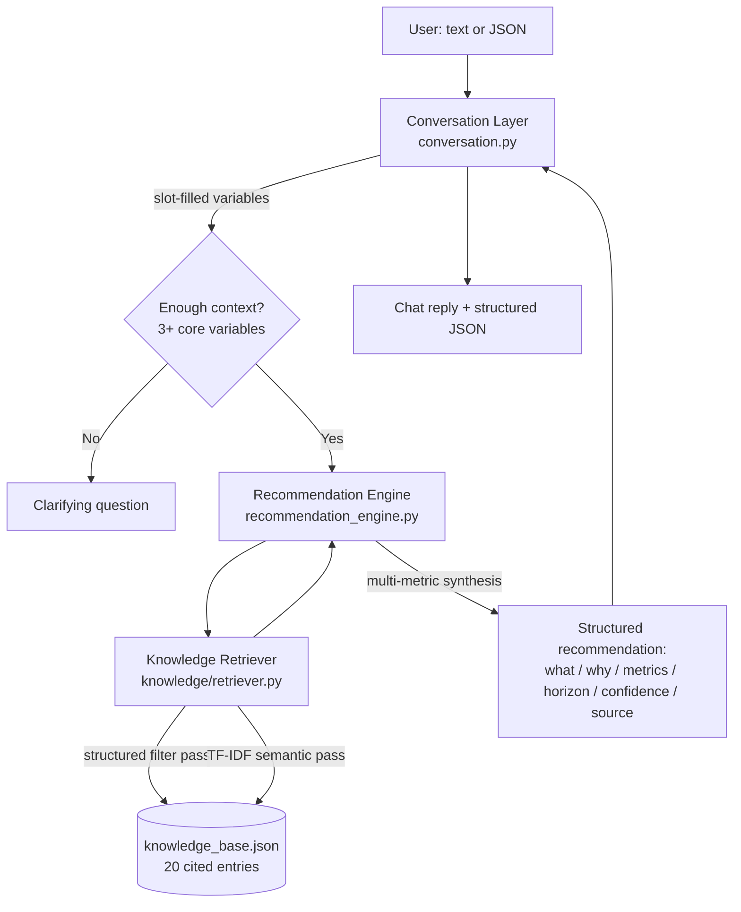

# Darukaa.Earth — AI Biodiversity Intelligence Chatbot

A knowledge-grounded conversational system that reasons about biodiversity, soil, land use, and
climate conditions, and produces evidence-backed, multi-metric recommendations — built for the
Darukaa.Earth Hackathon Challenge.

This is deliberately **not** a UI-heavy app. The engineering weight is in the knowledge layer and
the reasoning engine; the chat interface is a thin, minimal demo shell.

---

## Why this design

The brief explicitly rules out "generic LLM-only solutions." So this system does not ask a
language model to recall biodiversity facts from memory. Instead:

1. Every fact is stored in a **structured, auditable knowledge base** (`knowledge_base.json`),
   with a real citation (FAO / IPCC / peer-reviewed literature) attached to every entry.
2. A **retrieval layer** (RAG) pulls the relevant entries for a given situation, using both
   deterministic condition-matching and TF-IDF semantic search — never free-form generation of
   facts.
3. A **reasoning engine** assembles retrieved knowledge into recommendations that explicitly
   connect multiple environmental variables (soil ↔ biodiversity, water ↔ species survival, land
   use ↔ fragmentation), rather than single-variable advice.
4. A **conversation layer** tracks what's known across turns and only reasons once there's enough
   grounded context — otherwise it asks a clarifying question, same as a real environmental
   scientist would before giving advice.

No LLM API call is required to run this system at all — the "intelligence" is the retrieval +
reasoning pipeline. (An LLM could be layered on top purely to smooth surface language, but the
facts, mechanisms, metrics, and citations below are never LLM-generated — see "Optional LLM layer"
at the bottom.)

---

## Architecture



### Components

| Layer | File | Responsibility |
|---|---|---|
| API | `backend/app.py` | FastAPI endpoints, session store, request/response wiring |
| Schemas | `backend/models.py` | Pydantic request/response contracts |
| Conversation | `backend/conversation.py` | Multi-turn memory, slot-filling, clarifying questions, lightweight text→variable extraction |
| Reasoning | `backend/recommendation_engine.py` | Multi-metric synthesis, cross-variable linkage, evidence formatting |
| Knowledge retrieval | `backend/knowledge/retriever.py` | RAG: structured condition matching + TF-IDF semantic search |
| Knowledge base | `backend/knowledge/knowledge_base.json` | 20 structured, cited findings across soil/land/biodiversity/climate/human-impact |
| Frontend | `frontend/index.html` | Minimal single-page chat demo (no framework, calls the API directly) |

### Data flow for one request

1. User sends text ("Soil organic carbon is 0.3%, rainfall is low, monoculture wheat, semi-arid") or JSON.
2. `conversation.py` extracts variables via regex/keyword rules (`update_from_text`) or accepts them
   directly (`update_from_structured`), and merges them into session memory.
3. If fewer than 3 core variables (`soil_organic_carbon`, `rainfall`, `land_use`) are known, the
   system returns a targeted clarifying question instead of guessing.
4. Once enough context exists, `retriever.py` runs two retrieval passes:
   - **Structured pass**: matches each knowledge entry's `trigger_conditions` against known
     variables (e.g. `soil_organic_carbon < 1.0`) — deterministic and auditable.
   - **Semantic pass**: TF-IDF cosine similarity over entry text, to catch relevant knowledge that
     doesn't have an exact structured trigger, or to handle free-text questions.
5. `recommendation_engine.py` turns retrieved entries into the required output shape (what to do /
   why it works / metrics impacted / time horizon / confidence / source) and explicitly reports
   which **cross-variable relationships** are in play (e.g. "rainfall governs soil moisture, which
   constrains the soil microbial community").
6. The response is returned both as natural-language chat text and as structured JSON
   (`structured_result`) for programmatic consumers.

### Why TF-IDF instead of a downloaded embedding model

TF-IDF is local, deterministic, and fully explainable — you can point at exactly which terms drove
a retrieval match, which matters for a "scientific grounding" evaluation criterion. Swapping in a
dense embedding model + vector DB (e.g. `sentence-transformers` + FAISS/Chroma/Pinecone) is a
drop-in upgrade behind the same `KnowledgeRetriever.retrieve()` interface — nothing else in the
system would need to change. That upgrade path is noted directly in `retriever.py`.

---

## Knowledge base schema

Each of the 20 entries in `backend/knowledge/knowledge_base.json` follows this schema:

```json
{
  "id": "KB001",
  "category": "soil_health",
  "variables": ["soil_organic_carbon", "biodiversity", "land_use"],
  "trigger_conditions": {"soil_organic_carbon": "<1.0"},
  "finding": "What the science shows",
  "intervention": "What to do",
  "mechanism": "Why it works, scientifically",
  "quantitative_impact": "Measurable, cited estimate of effect size",
  "impacted_metrics": ["soil_organic_carbon", "microbial_diversity", "pollinator_support"],
  "time_horizon": "short | medium | long",
  "confidence": "high | medium",
  "source": "Real citation (FAO / IPCC / peer-reviewed study, with year)"
}
```

Categories covered: `soil_health`, `land_use`, `biodiversity`, `climate`, `human_impact` — matching
all five domains required by the brief. `trigger_conditions` support exact match, substring match,
and numeric thresholds (`<x`, `>x`).

---

## Local setup

Requirements: Python 3.11+

```bash
git clone <this-repo-url>
cd darukaa-biodiversity-ai/backend
python -m venv venv && source venv/bin/activate   # Windows: venv\Scripts\activate
pip install -r requirements.txt

uvicorn app:app --reload --port 8000
```

Then open **http://localhost:8000/** for the demo chat UI, or call the API directly:

```bash
curl -X POST https://ai-biodiversity-intelligencee.onrender.com/api/chat 
  -H "Content-Type: application/json" \
  -d '{"session_id": "demo", "message": "Soil organic carbon is 0.3%, rainfall is low, monoculture wheat, semi-arid region"}'
```

More examples (including structured JSON and geo-coordinate input) are in `sample_requests.md`.

### Run with Docker

```bash
docker compose up --build
```

### Run tests

```bash
cd backend
pytest tests/ -v
```

9 tests cover: retrieval (structured + semantic), multi-metric reasoning output shape, slot-filling
from free text, clarifying-question behavior, and both API endpoints end-to-end.

---

## API reference

| Endpoint | Method | Purpose |
|---|---|---|
| `/chat` | POST | Free-text input, multi-turn, session-memory aware |
| `/chat/structured` | POST | Structured JSON input; accepts optional `latitude`/`longitude` |
| `/session/{id}` | GET | Inspect a session's accumulated variables (demo/debug aid) |
| `/health` | GET | Liveness probe |

Request/response schemas are in `backend/models.py` and are also browsable live via FastAPI's
auto-generated docs at `/docs` once the server is running.

---

## How each brief requirement is met

| Requirement | Where |
|---|---|
| Structured, retrievable knowledge layer (not just prompts) | `knowledge_base.json` + `retriever.py` |
| Soil / land use / biodiversity / climate / human impact coverage | All 5 categories present in KB |
| Clarifying questions on incomplete input | `conversation.py::next_clarifying_question` |
| Multi-turn memory | `ConversationSession` keyed by `session_id`, held across turns |
| Evidence-backed recommendations (what/why/metric/source) | `recommendation_engine.py` output shape |
| Multi-metric reasoning (soil↔biodiversity, water↔species, land use↔fragmentation) | `VARIABLE_LINKS` in `recommendation_engine.py`, surfaced per-response |
| Text input | `/chat` |
| Structured (JSON) input | `/chat/structured` |
| Geo-coordinates (bonus) | `latitude`/`longitude` fields on `/chat/structured` |
| Recommendation / metrics / time horizon / confidence | Every recommendation object |
| ≥3 environmental variables reasoned together | `has_enough_context()` enforces this before any recommendation is generated |

---

## CI/CD

`.github/workflows/ci.yml` runs on every push/PR to `main`: installs dependencies, runs the pytest
suite, and does a syntax check across all backend modules. A green check is required before
merging in a team setting; for solo/hackathon use it's a fast correctness gate.

**Suggested deploy path** (not automated in this repo, documented for reviewers): build the
`Dockerfile` image and deploy to Render / Railway / Fly.io / any container host; set the start
command to the image's default `CMD`. No environment variables are required for the core system
since it has no external API dependency.

---

## Project structure

```
darukaa-biodiversity-ai/
├── backend/
│   ├── app.py                  # FastAPI entrypoint
│   ├── models.py                # Pydantic schemas
│   ├── conversation.py          # Multi-turn memory + slot filling
│   ├── recommendation_engine.py # Multi-metric reasoning
│   ├── knowledge/
│   │   ├── knowledge_base.json  # 20 cited structured entries
│   │   └── retriever.py         # RAG: structured + TF-IDF semantic retrieval
│   ├── tests/
│   │   └── test_basic.py
│   └── requirements.txt
├── frontend/
│   └── index.html               # Minimal demo chat UI
├── .github/workflows/ci.yml
├── Dockerfile
├── docker-compose.yml
├── sample_requests.md
└── README.md
```

---

## Optional LLM layer (not required, noted for completeness)

The core reasoning above is fully deterministic and requires no LLM. If a more conversational
surface layer is desired on top (e.g., to rephrase the structured recommendation more fluidly),
the `structured_result` returned by `/chat` is designed to be handed as-is to an LLM call with a
system prompt like *"rephrase this data conversationally without inventing new facts"* — the
knowledge/citations remain the deterministic source of truth either way, so scientific grounding is
never at the mercy of model hallucination.

---

## Known limitations / next steps

- Knowledge base currently has 20 curated entries; a production system would ingest a larger
  corpus of papers/reports (PDF/CSV ingestion pipeline) into the same schema.
- Session memory is in-process; swap for Redis/Postgres for multi-instance deployment.
- Geo-coordinates are currently stored but not yet used to auto-infer region/climate — a natural
  next step is reverse-geocoding + a climate/soil API lookup to auto-fill variables.
